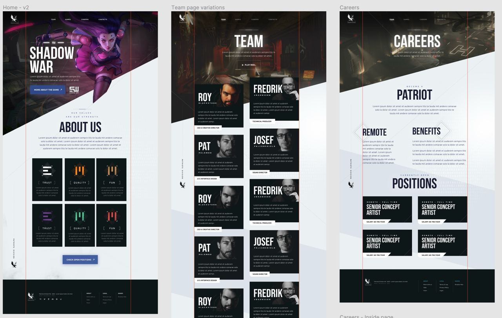
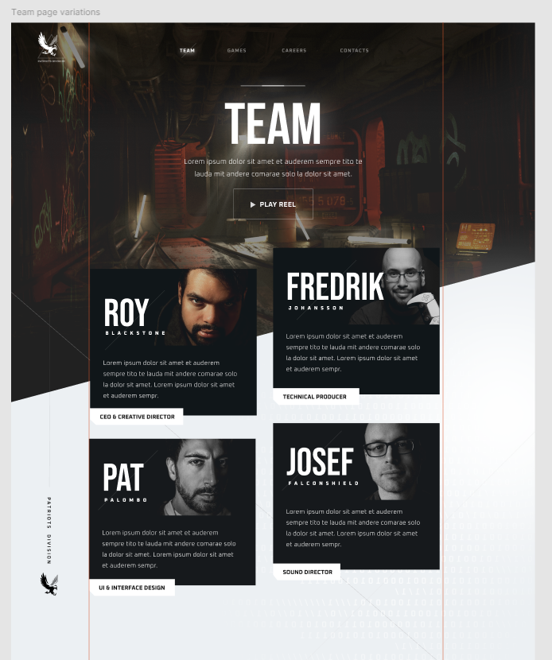

# Project Title
Patriots Division

## Overview

Patriots Division is a start up that develops video games, they need an app to convey information about their company and team to potential investors and employees.

### Problem

The way that most startups communicate information to potential investors is through slides decks that are not as exciting to look at or as easy to access as an app or website.  Most investors look at a deck a few times around the time of a presentation, but then it gets lost amongst their other links and files.  By having an app, the important information about a company is easily accessible in the future.  Many startups are eager to set up a digital presence, but there is considerable expense to doing so.  This app creates a template that could make building team websites for startups more attainable.

### User Profile

Patriots Division could be for any company wanting to build an app to convey information about their company, team, and potential employment opportunities.  Many companies work on multiple projects/startups, so a separate team site may be suitable.

### Features

Company information.  Team bios.  Careers page with open positions, should link to form where people can apply and submit resumes.

## Implementation

### Tech Stack

- React
- MySQL
- Express
- Node.js
- Client libraries:
    - react
    - react-router
    - axios
- Server libraries
    - knex
    - express

### APIs

- No external APIs will be used. Unless it's in the nice to have.

### Sitemap

- Home: company information and intro to the game in development, ShadowWar
- Team: team photos and bios
- Careers: informations about working for the company, available opportunities.
- Apply: form to apply to open positions

### Mockups

#### Home, Team, and Careers Pages

#### Team saturate on hover

### Data

Team bios: photos, names, and bio.
Job listing: available jobs.
User data: those who have applied for jobs, their contact information and attached resume.

### Endpoints

GET (get available jobs)
GET (team members)
POST (a job application)

### Auth

--not sure yet

## Roadmap

Setup project structure.  Acquire all assets required for app.  Develop pages.  Finalize and connect all features.  Testing and edits.

## Nice-to-haves

- Video of the game on the site.
- Possible Shadow War lobby music to play when opening the site.
-- https://www.youtube.com/watch?v=HBdC3jnZyKw
- Could incorporate loyalty protocol music or videos somewhere in team or careers pages.
-- https://www.youtube.com/watch?v=GenHD72bN9I
- Have an interactive component with the game characters.  Although the game's website is already comprehensive.
-- https://www.shadowwar.com/operatives
