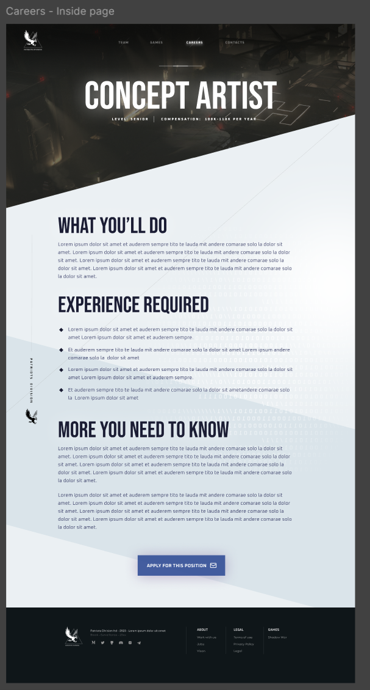
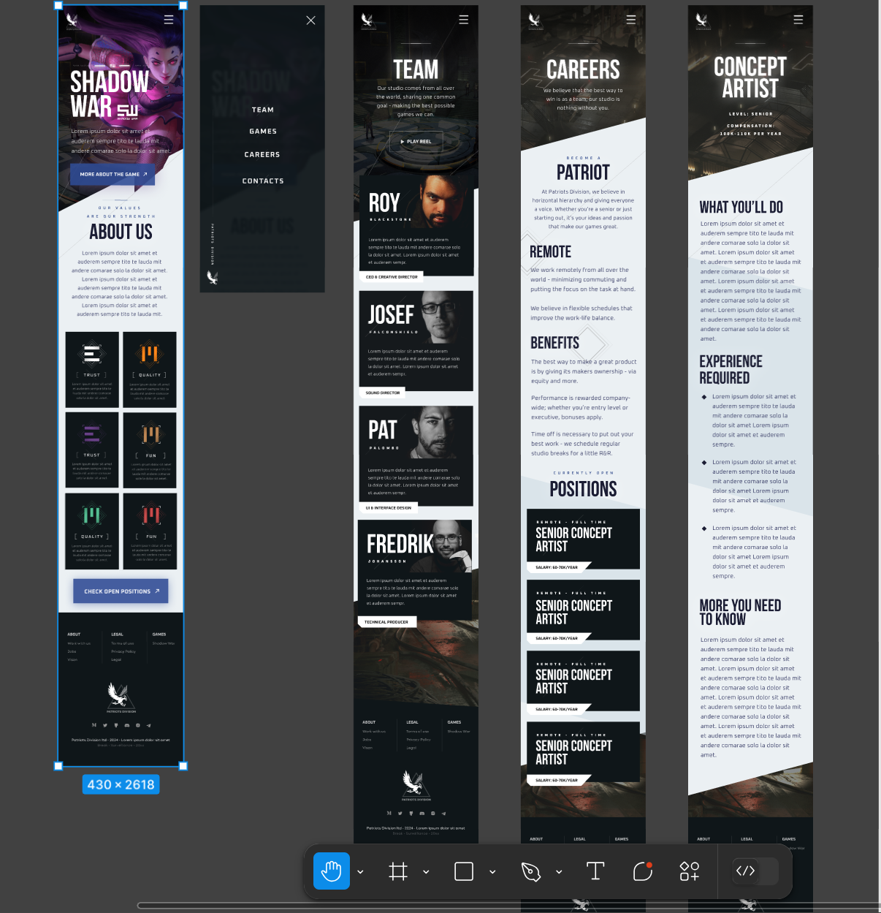

# Project Title
StartSite -- Phase 1 Implementation for client company Patriots Division

## Overview

Patriots Division is a start up that develops video games, they need an app to convey information about their company and team to potential investors and employees, this is where StartSite comes in.

My project is divided into two phases. 

In Phase 1, I will build a company website featuring company info, their values,  team bios, job postings it’ll have the ability to apply for them through the site, and a messaging functionality.   This is the Brainstation Capstone project.

In Phase 2, I will create a template from this website and deploy it in an app, allowing other startups to easily customize and maintain their own sites.

### Problem

The way that most startups communicate information to potential investors is through slides decks that are not as exciting to look at or as easy to access as an app or website.  Most investors look at a deck a few times around the time of a presentation, but then it gets lost amongst their other links and files.  By having an app, the important information about a company is easily accessible in the future.  Many startups are eager to set up a digital presence, but there is considerable expense to doing so.  This app creates a template that could make building team websites for startups more attainable.

Many startups struggle with creating a professional online presence, and the question is, why does a website matter? Startups often rely on social media but they lack a credible website that showcases their team and open job opportunities. However, as these companies try to grow, attract talent, and fundraise, it is challenging for them to appeal to outside investors without establishing a professional persona and trustworthy company presence.  These issues are helped by establishing a website, making it easier for stakeholders to access essential information about the company.

### User Profile

StartSite could be for any company wanting to build an app to convey information about their company, team, and potential employment opportunities.  Many companies work on multiple projects/startups, so a separate team site may be suitable.

### Features

Company information with values.  Team bios.  Careers page with open positions, should link to form where people can apply and submit resumes.  Contacts page where you can submit a message to the company.

## Implementation

### Tech Stack

- React
- MySQL
- Express
- Node.js
- Client libraries:
    - react
    - react-router
    - axios
    - sweetalert for popups
- Server libraries
    - knex
    - express
    - multer for pdf uploads

### APIs

- No external APIs will be used. Unless it's in the nice to have.

### Sitemap

- Home: company information and intro to the game in development, ShadowWar. Company values.
- Team: team photos and bios. Bios link to team member's linkedin profile.
- Careers: informations about working for the company, available opportunities.
- Apply: form to apply to open positions
- Contact: page to send the company a message.

### Mockups -- please note, all mockups were provided by the clients' designer

#### Home, Team, and Careers Pages for Desktop

#### Job Application Page for Desktop

#### Home, Modal, Team, Careers, and Job Application Pages for Mobile

#### Contacts Page for Mobile and Desktop
- this was designed by me, no mockup.  Styled based off of other pages.

#### Team saturate on hover
- since the color images weren't provided, I brightened the images on hover.

### Data

Team bios: photos, names, and bio.
Job listing: available jobs.
User data: those who have applied for jobs, their contact information and attached resume.

### Endpoints

GET (get available jobs)
GET (team members)
POST (a job application with pdf)
POST (a message in contacts page)

## Roadmap

Setup project structure.  Acquire all assets required for app.  Develop pages.  Finalize and connect all features.  Testing and edits.

## Nice-to-haves

- Video of the game on the site.
- Possible Shadow War lobby music to play when opening the site. [took this out because client did not want music]
-- https://www.youtube.com/watch?v=HBdC3jnZyKw
- Could incorporate loyalty protocol music or videos somewhere in team or careers pages.
-- https://www.youtube.com/watch?v=GenHD72bN9I
- Have an interactive component with the game characters.  Although the game's website is already comprehensive.
-- https://www.shadowwar.com/operatives
